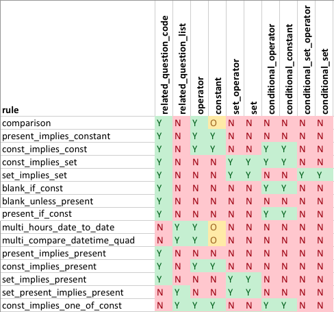

# File Layout #

Rules are specified in \<data entry form name>_cross_question_validations.csv - one per line. Questions can have multiple rules, and the rules are processed from earliest to latest (however processing order is unimportant)

A cross question validation file contains 15 columns, which can be thought of in two classes: Description columns and parameter columns. Description columns instruct the application as to which rule to run, which questions it is associated with and the error text. Parameter columns tell the rule how it should work

* Description Columns
  * itemnum 
  * comments 
  * question_code 
  * related_question_code 
  * related_question_list 
  * rule 
  * error_message 
* Parameter Columns
  * operator 
  * constant 
  * set_operator 
  * set 
  * conditional_operator 
  * conditional_constant 
  * conditional_set_operator 
  * conditional_set 

Any extra columns not listed above will be ignored by the application.

## Description Columns
All fields except related_question_code/list are mandatory. Either (but not both) of relate_question_code/list must be supplied.

Column | Description | Usage
-------|-------------|------
itemnum |  This column is only used during import. If an error is encountered, the value in this field will be displayed for each offending row  |  A unique identifier, does not have to be numeric 
comments |  Human readable comments to aid future maintainers in understanding rules. The comments are stored in the database but never actually used  |  Free text 
question_code |  The base question that this CQV applies to  |  A question code from the data entry form (Case sensitive) 
related_question_code |  The other question that this CQV applies to (one-to-one rules only) |  A question code from the data entry form (Case sensitive) 
related_question_list |  The other questions that this CQV applies to (one-to-many rules only)  | Comma separated list of question codes (Case sensitive)
rule |  The rule to be applied  | See Rules below
error_message |  Text that is displayed to the user if validation fails  | Free text

## Parameter Columns
No parameter column is mandatory, however specific rules will require specific columns be supplied. See Rules below.

Column | Valid Data | Special Notes
-------|------------|--------------
operator | == <= >= < > \!= | Only == and != are permitted for textual constants and sets
constant | any decimal, integer or text 
set_operator | included, excluded, range, between | Only "included" and "excluded" are permitted for textual sets
set | list of numbers or text separated by commas and in square brackets where text is quoted | e.g. [1,3,5,7] or ["y","n","true","false"]
conditional_operator | == <= >= < > \!= | Only == and != are permitted for textual conditional constants and conditional sets
conditional_constant | any decimal, integer or text 
conditional_set_operator | included, excluded, range, between | Only "included" and "excluded" are permitted for textual sets
conditional_set | list of numbers or text separated by commas and in square brackets where text is quoted | e.g. [1,3,5,7] or ["y","n","true","false"]

Note: Text data within constants, sets, conditional constants and conditional sets are automatically converted to lower case upon rule ingestion. 

## Cross Question Validation Rules
### Generic Rules
Rule                        | Description                                                                                                                                                             
----------------------------|------------
comparison                  | Compare two answers. Related answer can optionally be offset by a numerical value stored in 'Constant' prior to comparison. This 'Constant' offset must be a decimal or integer in order to be used as an offset, textual constants are ignored                                                       
present_implies_constant    | If related_question is answered, this answer must meet (constant_expression)                                                                                            
const_implies_const         | If related_question meets (conditional constant expression), this answer must meet (constant expression)                                                                 
const_implies_set           | If related_question meets (conditional constant expression), this answer must meet (set expression)                                                                     
set_implies_set             | If related_question meets (conditional set expression), this answer must meet (set expression)                                                                          
blank_if_const              | Unless related_question meets (conditional constant expression), this answer must be blank                                                                              
blank_unless_present        | Unless this question is answered, related_question must be blank                                                                                                        
present_if_const            | If related_question meets (conditional constant expression), this question must be answered
multi_hours_date_to_date    | This rule is a 'comparison' comparing this answer with the difference (in hours) between two pairs of date/times. See below for more info                               
multi_compare_datetime_quad | This rule is a 'comparison' for two pairs of date/times. This rule should be applied to both the date and the time questions, See below for more info                   
present_implies_present     | If this question is answered, this related_question must be answered                                                                                                    
const_implies_present       | If this question meets (constant expression), related_question must be answered                                                                                         
set_implies_present         | If this question meets (set expression), related_question must be answered                                                                                              
set_present_implies_present | If this question meets (conditional set expression) AND (first related_question in list) is present, (second related_question in list) must be answered                 
const_implies_one_of_const  | If this answer meants (constant expression), then at least one of related_question_list must meet (conditional constant expression)                                     

#### Expected Columns

 
### Specialised Rules
Rule                         | Question Code  | Description                                                                                                                                                             
-----------------------------|----------------|-------------
special_dob                  |                | DOB must be in the same year as the year of registration
special_rule_comp1           | N_V_EGTH       | (n_v_egth + n_s_egth + n_eggs + n_recvd) must be >= (n_donate + n_ivf + n_icsi + n_egfz_s + n_egfz_v)
special_rule_comp2           | N_FERT         | n_fert must be <= (n_ivf + n_icsi)
special_rule_comp3           | N_S_CLTH       | (n_embrec_fresh + n_s_clth + n_v_clth + n_s_blth + n_v_blth + n_fert) >= (n_bl_et + n_cl_et + n_clfz_s + n_clfz_v + n_blfz_s + n_blfz_v + n_embdon_fresh)
special_rule_mtage           | N_EMBDISP      | If n_embdisp == 0 then (cyc_date >= fdob + 18 years) and (cyc_date <= fdob + 55 years)
special_rule_mtagedisp       | N_EMBDISP      | If n_embdisp > 0  then (cyc_date >= fdob + 18 years) and (cyc_date <= fdob + 70 years)
special_rule_pr_clin         | PR_CLIN        | If pr_clin equals 'y' then n_bl_et > 0 OR n_cl_et > 0 OR iui_date must be present
special_rule_gest_iui_date   | N_DELIV        | If gestational age (pr_end_dt - iui_date) is greater than 20 weeks then n_deliv must be present
special_rule_gest_et_date    | N_DELIV        | If gestational age (pr_end_dt - et_date) is greater than 20 weeks then n_deliv must be present
special_rule_thaw_don        | THAW_DON       | If (n_s_clth + n_v_clth + n_s_blth + n_v_blth) > 0 and don_age is complete then thaw_don must be complete
special_rule_surr            | DON_AGE        | If surr equals 'y' and (n_s_clth + n_v_clth + n_s_blth + n_v_blth) > 0 then don_age must be present
special_rule_et_date         | ET_DATE        | If et_date is a date then at least one of n_cl_et or n_bl_et must be > 0
special_rule_stim_1st        | STIM_1ST       | If stim_1st equals 'y' and iui_date=nil then opu_date must be complete or can_date must be complete
special_rule_pgt_2           | N_PGT_ET       | n_pgt_assay  + n_pgt_th >=n_pgt_et
special_rule_pgt_3           | N_PGT_TH       | (n_s_clth + n_v_clth + n_s_blth + n_v_blth) >= (n_pgt_th + ni_pgt_th)
special_rule_surr_3          | CYCLE_TYPE     | If surr='y' & cycle_type!= 7, then et_date = NULL & (n_bl_et+n_cl_et)=0
special_rule_cycletype_2_don | CYCLE_TYPE     | If cycle_type = 2 & n_eggrec_fresh & n_embrec_fresh & n_s_egth & n_v_egth & n_s_clth & n_s_blth & n_v_clth & n_v_blth=0, then (at least one of n_eggdon_fresh or n_embdon_fresh or n_egfz_s or n_egfz_v or n_blfz_s or n_blfz_v or n_clfz_s or n_clfz_v >0) 
special_rule_cycletype_2_rec | CYCLE_TYPE     | If cycle_type = 2 & n_eggdon_fresh & n_embdon_fresh & n_efgz_s &  n_egfz_v & n_blfz_s & n_blfz_v & n_clfz_s & n_clfz_v=0 then  (at least one of n_eggrec_fresh or n_embrec_fresh or n_s_egth or n_v_egth or n_s_clth or n_s_blth or n_v_blth or n_v_clth >0)
special_rule_ttc_1           | DATE_TTC       | If parent_sex=1 & art_reason=n then date_ttc!= ""
special_rule_thaw_1          | N_V_EGTH       | (n_v_egth + n_s_egth + n_eggs + n_eggrec_fresh) >= (n_eggdon_fresh + n_ivf + n_icsi + n_gift+ n_egfz_s + n_egfz_v)
special_rule_ttc_2           | DATE_TTC       | If parent_sex=1 &  art_reason=y then date_ttc= ""
special_rule_ivm             | IVM            | If cycle_type = 1, 2, 3 or 6 & (opu_date!="" or can_date!="") then ivm must be complete.
special_rule_art_reason      | ART_REASON     | If art_reason=y then ci_tube, ci_oth, ci_endo, ci_male and ci_unex=n
special_rule_ci_1            | MALE_DIAG      | If ci_male = y & parent_sex=1 & cycle_type=1, 3, 4, 5, 6 or 7, then male_diag must be complete
special_rule_sperm           | SP_QUAL        | If sp_site=e & sp_source=1 & (n_ivf>0 OR n_icsi>0) then sp_qual!=nil
special_rule_fdob_pat        | FDOB_PAT       | If cycle_type=8 & parent_sex=1,2 or 3 then fdob_pat must be complete.
special_rule_pgt_9           | NI_PGT_ET      | ni_pgt_assay + ni_pgt_th >=ni_pgt_et

### Operators
Operator | Description
---------|------------
== | Equal to
<= | Less than or equal to
\>=| Greater than or equal to
<  | Strictly less than
\> | Strictly greater than
!= | Not equal to
 
### Set Operators
Set Operator | Description
---|---
included | answer matches one of the supplied values
excluded | answer does not match any of the supplied values
range | answer lies between the first and last supplied value (inclusive)

### Expressions
Expressions take one of the following forms

Type | Form | Example | (Set_)Operator from example | Constant/Set from example
---|---|---|---|---
Comparison | (answer) (operator) (related_answer + (optional) constant) | BrthOrd <= Plurality + 1 | <= | 1
Constant Expression | (answer) (operator) (constant) | PNS == -1 | == | -1
Set Expression | (answer) (set_operator) (set) | PTL must be either 0 or -1 | included | \[-1,0]